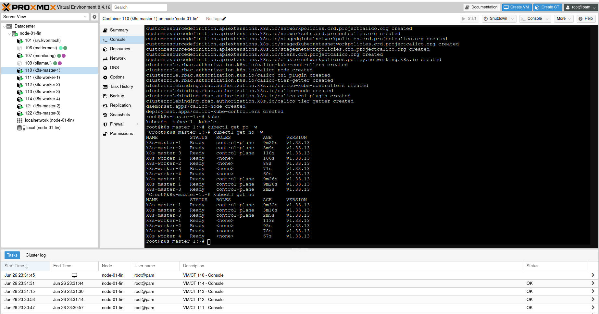
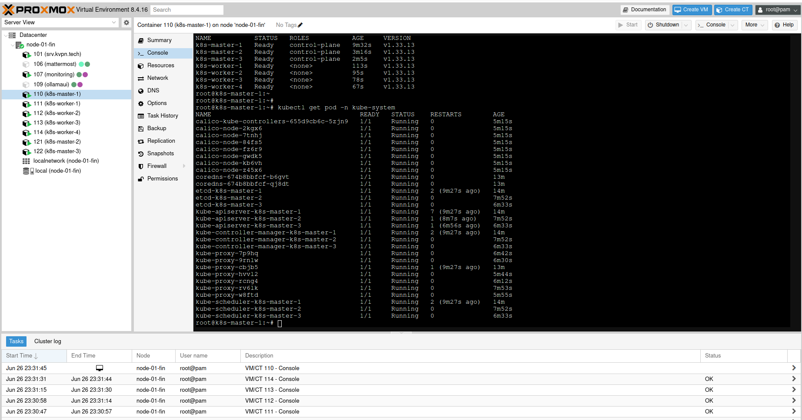

# Домашнее задание к занятию «Helm»

### Цель задания

В тестовой среде Kubernetes необходимо установить и обновить приложения с помощью Helm.

------

### Чеклист готовности к домашнему заданию

1. Установленное k8s-решение, например, MicroK8S.
2. Установленный локальный kubectl.
3. Установленный локальный Helm.
4. Редактор YAML-файлов с подключенным репозиторием GitHub.

------

### Инструменты и дополнительные материалы, которые пригодятся для выполнения задания

1. [Инструкция](https://helm.sh/docs/intro/install/) по установке Helm. [Helm completion](https://helm.sh/docs/helm/helm_completion/).

------


### Задание 1. Установить кластер k8s с 1 master node

    Подготовка работы кластера из 5 нод: 1 мастер и 4 рабочие ноды.
    В качестве CRI — containerd.
    Запуск etcd производить на мастере.
    Способ установки выбрать самостоятельно.

* смотри задание 2
## Дополнительные задания (со звёздочкой)

Настоятельно рекомендуем выполнять все задания под звёздочкой. Их выполнение поможет глубже разобраться в материале.
Задания под звёздочкой необязательные к выполнению и не повлияют на получение зачёта по этому домашнему заданию.

### Задание 2*. Установить HA кластер

    Установить кластер в режиме HA.
    Использовать нечётное количество Master-node.
    Для cluster ip использовать keepalived или другой способ.

#### Конфигурация балансировщика `/etc/haproxy/haproxy.cfg`:
```text
frontend k8s-api
    bind 10.10.0.100:6443
    mode tcp
    option tcplog
    default_backend k8s-masters

backend k8s-masters
    mode tcp
    option tcplog
    option httpchk GET /healthz
    balance roundrobin
    server k8s-master-1 10.10.0.110:6443 check check-ssl verify none
    server k8s-master-2 10.10.0.121:6443 check check-ssl verify none
    server k8s-master-3 10.10.0.122:6443 check check-ssl verify none
```

#### Инициализация HA-кластера через конфигурационный файл `kubeadm-config.yaml`:
```yaml
apiVersion: kubeadm.k8s.io/v1beta4
kind: InitConfiguration
localAPIEndpoint:
  advertiseAddress: 10.10.0.110
  bindPort: 6443
nodeRegistration:
  criSocket: unix:///run/containerd/containerd.sock
---
apiVersion: kubeadm.k8s.io/v1beta4
kind: ClusterConfiguration
kubernetesVersion: v1.33.13
controlPlaneEndpoint: "10.10.0.100:6443"
networking:
  podSubnet: 10.244.0.0/16
apiServer:
  certSANs:
  - 10.10.0.100
  - 45.144..* # чувствительная инфа
```
*Запуск производился командой:*
```bash
kubeadm init --config kubeadm-config.yaml --upload-certs --ignore-preflight-errors=all
```

#### Сетевой плагин (CNI):
В качестве сетевого провайдера развернут **Calico** для обеспечения маршрутизации подов по всей топологии кластера из 7 нод.

---

### Результаты проверки кластера

Управление кластером осуществляется через отказоустойчивую конечную точку виртуального IP `10.10.0.100`. Все 7 нод кластера (3 мастера и 4 воркера) успешно связаны, прошли сетевую инициализацию Calico и находятся в активном состоянии.

#### Вывод команды проверки статуса нод `kubectl get nodes`:


#### Вывод системных подов `kubectl get pods -n kube-system`:



### Правила приёма работы

    Домашняя работа оформляется в своем Git-репозитории в файле README.md. Выполненное домашнее задание пришлите ссылкой на .md-файл в вашем репозитории.
    Файл README.md должен содержать скриншоты вывода необходимых команд kubectl get nodes, а также скриншоты результатов.
    Репозиторий должен содержать тексты манифестов или ссылки на них в файле README.md.
